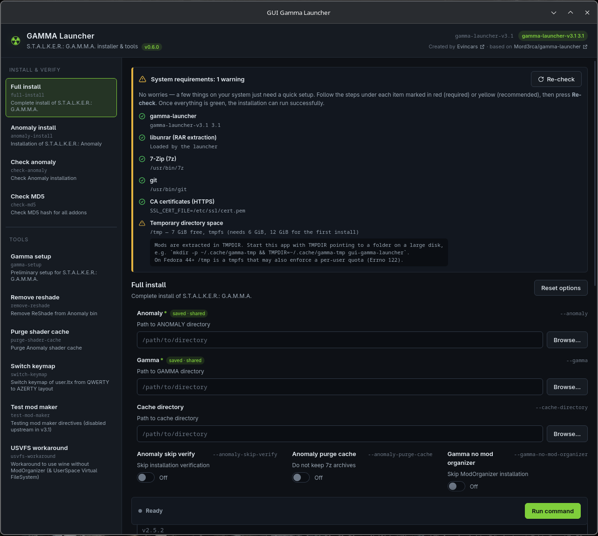
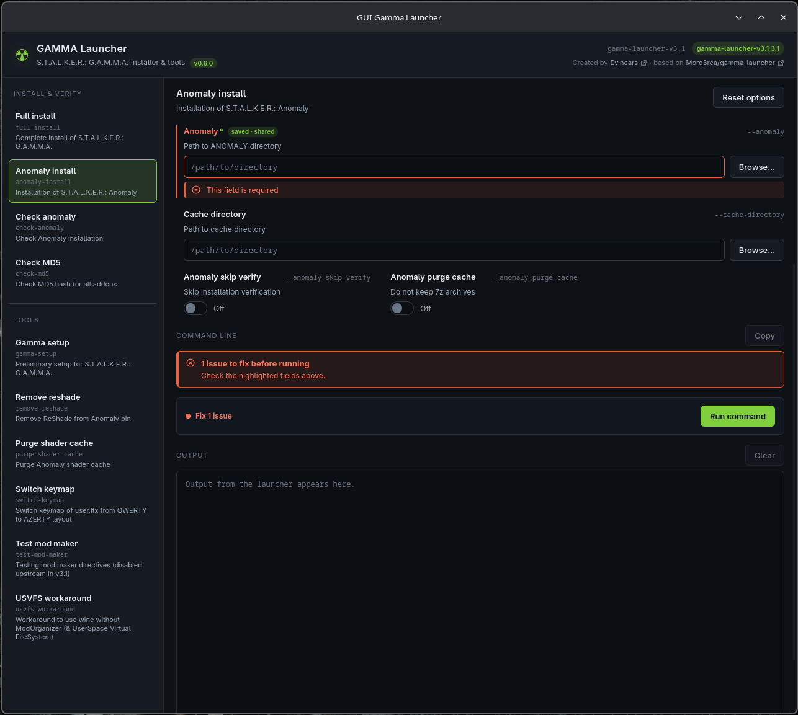
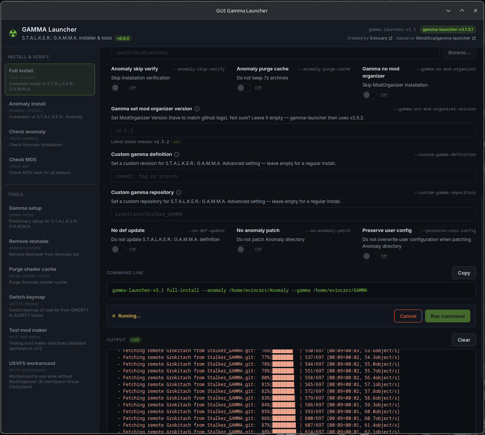

# GUI Gamma Launcher

A desktop GUI for [Mord3rca/gamma-launcher](https://github.com/Mord3rca/gamma-launcher), the
command-line tool that installs and maintains **S.T.A.L.K.E.R.: G.A.M.M.A.** on Linux and
Windows. Instead of typing CLI flags by hand, pick a command from the sidebar, fill in the
folder pickers, and watch the output stream live — with the exact command line always visible
so you know what's about to run.

Built with [Tauri](https://tauri.app/) + [Vue 3](https://vuejs.org/), wrapping the official
`gamma-launcher` binary as a sidecar.

## Screenshots

<p align="center">
  
  
  
</p>

## Features

- **Every `gamma-launcher` command**, grouped into *Install & verify* and *Tools*: full install,
  Anomaly install/check, MD5 check, GAMMA setup, ReShade removal, shader cache purge, keymap
  switch, mod-maker test, and the USVFS workaround.
- **Folder pickers** instead of typing paths — Anomaly/GAMMA paths are remembered and shared
  across commands.
- **Live validation** — required fields and the exact resulting command line are shown before
  you run anything.
- **Streamed output** with cancel support, so long operations like a full install don't lock up
  the UI.
- **System requirements check** (the CLI binary, `libunrar`, 7-Zip, git, CA certificates, scratch
  disk space) with guidance for anything missing.
- Dark theme throughout.

## Installation & Run

Grab the latest build for your OS from the [Releases page](../../releases). Windows and Linux
builds are published automatically (see [Releasing](#releasing-maintainers) below); there is
currently no macOS build (see [Platform support](#platform-support)).

### Linux

Each release has three Linux artifacts — pick one:

- **`.deb`** (Debian/Ubuntu and derivatives) — a real package, installed through your package
  manager, with a desktop entry and icon added for you:
  ```sh
  sudo apt install ./gui-gamma-launcher_<version>_amd64.deb
  ```
- **`.rpm`** (Fedora/openSUSE and derivatives) — likewise a real package:
  ```sh
  sudo dnf install ./gui-gamma-launcher-<version>-1.x86_64.rpm
  # or: sudo rpm -i ./gui-gamma-launcher-<version>-1.x86_64.rpm
  ```
- **`.AppImage`** — a portable build for any distro. This one isn't installed by a package
  manager, so yes: you're just running the ELF directly. Make it executable once, then run it:
  ```sh
  chmod +x gui-gamma-launcher_<version>_amd64.AppImage
  ./gui-gamma-launcher_<version>_amd64.AppImage
  ```
  For a menu entry / icon with AppImages, use an AppImage integration tool such as
  [AppImageLauncher](https://github.com/TheAssassin/AppImageLauncher) or
  [Gear Lever](https://github.com/mijorus/gearlever) — this repo doesn't set one up for you.

The bundled `gamma-launcher` CLI needs `libunrar` on your system for RAR extraction (the app's
system requirements check will tell you if it's missing); everything else it needs (7-Zip, git)
is checked the same way.

### Windows

Run the `.msi` or `.exe` installer from the release and follow the prompts.

## Development

Requires [Node.js](https://nodejs.org/) and the [Rust toolchain](https://www.rust-lang.org/tools/install),
plus Tauri's [platform prerequisites](https://tauri.app/start/prerequisites/).

```sh
npm install
npm run tauri dev
```

`npm run tauri build` produces a release build using the same steps CI runs.

The bundled `gamma-launcher` CLI binary lives in `src-tauri/binaries/`. On Linux it's committed
to the repo; other platforms need the matching binary added there before building (see
`.github/workflows/release.yml` for how CI fetches it).

### Project layout

```
src/                     Vue frontend
  components/            one component per UI section, common/ has the generic input primitives
  composables/            shared state: schema, form, requirements, runner
  lib/gammaLauncher.ts    typed bindings to the Tauri commands below
src-tauri/src/gamma/      the mapper: CLI spec, argument builder, requirements/runner commands
```

## Contributing

Issues and pull requests are welcome:

1. Fork the repo and create a branch off `main`.
2. Make your change (`npm run build` and `cd src-tauri && cargo test` should both pass).
3. Open a PR describing what changed and why.

## Releasing (maintainers)

Releases are built by [`.github/workflows/release.yml`](.github/workflows/release.yml), which
triggers on any pushed `v*` tag:

1. Bump the version in `package.json`, `src-tauri/tauri.conf.json`, and `src-tauri/Cargo.toml`
   (keep all three in sync) and commit it.
2. Tag and push:
   ```sh
   git tag v0.7.0
   git push origin v0.7.0
   ```
3. GitHub Actions builds Windows and Linux bundles and attaches them to a **draft** release named
   after the tag. Review the draft on the [Releases page](../../releases) and publish it when
   you're happy with it.

### Platform support

`gamma-launcher` is bundled as a Tauri sidecar, which needs a real platform binary per target —
Mord3rca/gamma-launcher only publishes `gamma-launcher` (Linux) and `gamma-launcher.exe`
(Windows), so that's what CI fetches and what's committed under `src-tauri/binaries/`. To add
macOS, build (or obtain) `gamma-launcher-v3.1-x86_64-apple-darwin` and
`gamma-launcher-v3.1-aarch64-apple-darwin` yourself, commit them (or fetch them in CI the same
way the Windows binary is fetched), and re-add a `macos-latest` entry to the release workflow's
matrix.

## Credits

Created by [Evincars](https://lasak.netlify.app/). Wraps
[Mord3rca/gamma-launcher](https://github.com/Mord3rca/gamma-launcher), which does all the actual
installation work.
